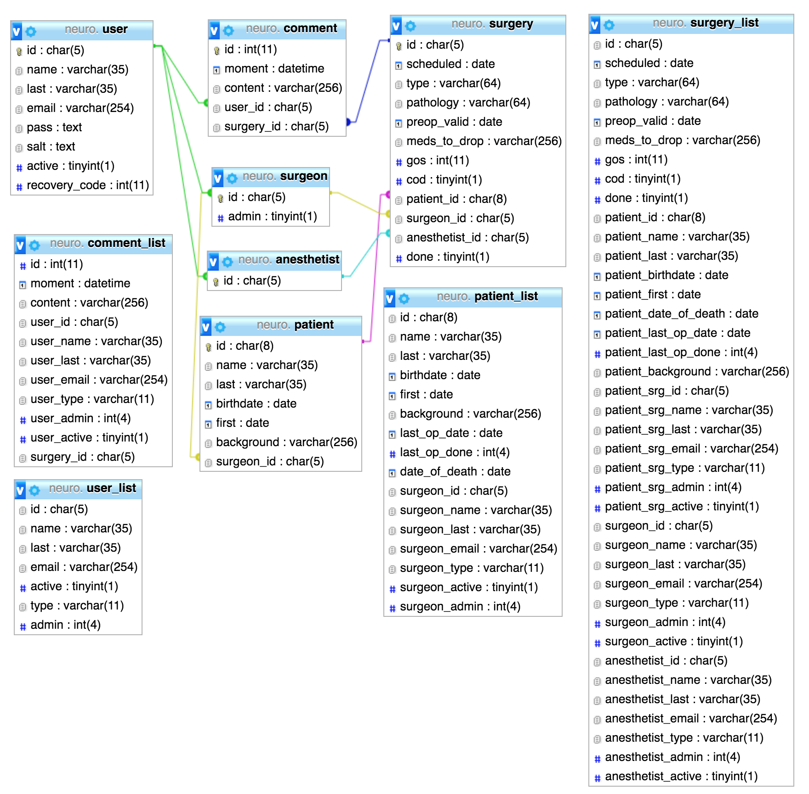
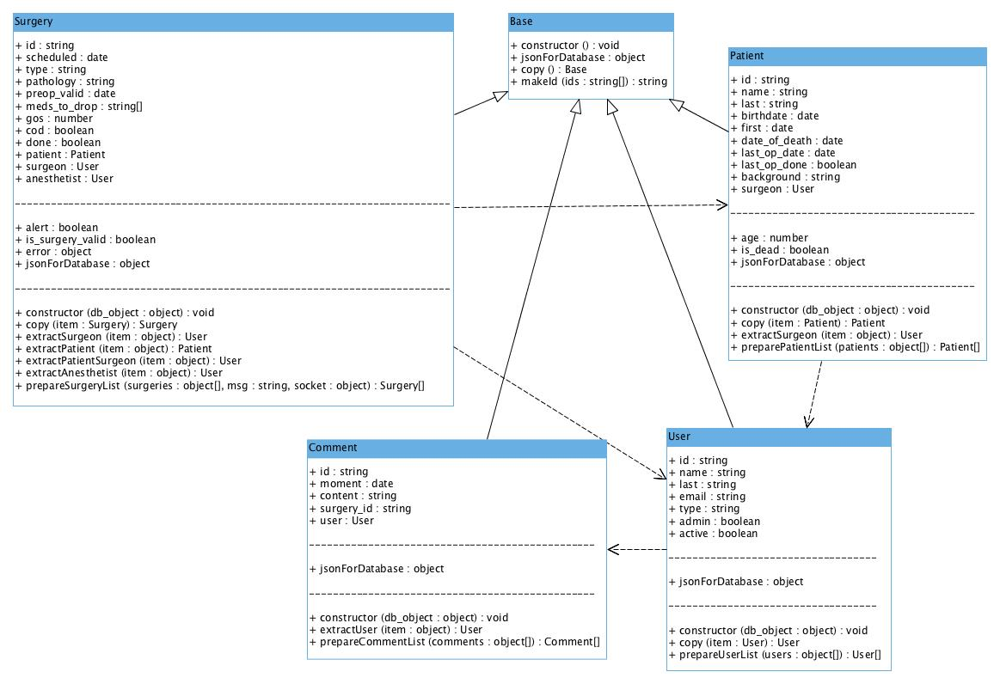
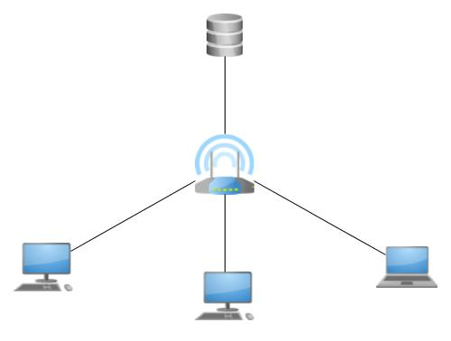

#Neuro.ORG

####Project overview

This project was made for the neurosurgery team at the Maciel Hospital in Montevideo, Uruguay.
The goal of it was to be able to interact with patient and surgery data stored on a MySQL database with ease.
It allows users to see a list of patients and another one of surgeries, inside which they are able to sort data in real time, input new information and search for specific past entries by means of an embedded search engine.
A print functionality is also offered in the surgery list.

##The database

###Data dictionary

####User
Name|Key|Type|Description
--- | --- | --- | -------
id | pk | char(5) | User ID number
name | | varchar(35) | User name
last | | varchar(35) | User last name
email | | varchar(254) | User email
pass | | text | Encrypted user pass
salt | | text | Cryptographic salt
active | | boolean | Can the user log in?
recovery_code | | int | Password recovery code

####Surgeon
Name|Key|Type|Description
--- | --- | --- | -------
id | pk | char(5) | User ID number
admin | | boolean | Is the user an admin?

####Anesthetist
Name|Key|Type|Description
--- | --- | --- | -------
id | pk | char(5) | User ID number

####Patient
Name|Key|Type|Description
--- | --- | --- | -------
id | pk | char(8) | Patient ID number
name | | varchar(35) | Patient name
last | | varchar(35) | Patient last name
birthdate | | date | Patient birthdate
first | | date | Patient first visit
background | | varchar(256) | Extra info on the patient
surgeon_id | fk(surgeon) | char(5) | Surgeon in charge of patient

####Surgery
Name|Key|Type|Description
--- | --- | --- | -------
id | pk | char(5) | Surgery ID number
scheduled | | date | When did/will the surgery take place?
type | | varchar(64) | Type of procedure
pathology | | varchar(64) | What is being treated?
preop_valid | | date | When the surgeon validated the surgery
meds_to_drop | | varchar(256) | Meds the patient cant take pre surgery
gos | | int | Glasgow Outcome Score
cod | | boolean | Cause of death
patient_id | fk(patient) | char(8) | Patient to be/who was treated
surgeon_id | fk(surgeon) | char(5) | Surgeon in charge of surgery
anesthetist_id | fk(anesthetist) | char(5) | Anesthetist who validated the surgery

####Comment
Name|Key|Type|Description
--- | --- | --- | -------
id | pk | int | Comment ID number
moment | | datetime | When the comment was stored
content | | varchar(256) | What the user wrote
user_id | fk(user) | char(5) | The user who commented
surgery_id | fk(surgery) | char(5) | Surgery the comment corresponds to

##The data model

##The network

There needs to be a MySQL server accessible by all clients. All other operations are handled by each client on their own.

##Password recovery engine

When a user forgets their pass they are given the option to click on a hyperlink which will start a process to recover it.
To do this, the program emails the user a code they will need to input in the next screen in order to be able to change their password.
After that they will be able to login with their new pass.

##Standards used in code

* [Standard javascript](https://standardjs.com/)
* [JSDoc comments](http://usejsdoc.org/)

##Configuring the clients

Two files need to be configured in each client:

  * auth-info.json
  * server-info.json

Both files can be found in the ~/resources/data directory of the folder that you get when you download the binaries.
The purpose of the first file is to define an email for the app to use as a sender for recovery code emails. It is encrypted using a Vigenere algorithm.
The purpose of the second file is to store the login credentials for the app to access the database. It is also encrypted by means of the Vigenere algo.
Each field uses a different encryption key which can only be retreived by looking at the appropriate portion of the code.

As long as those two files contain the necessary information the app is usable.
